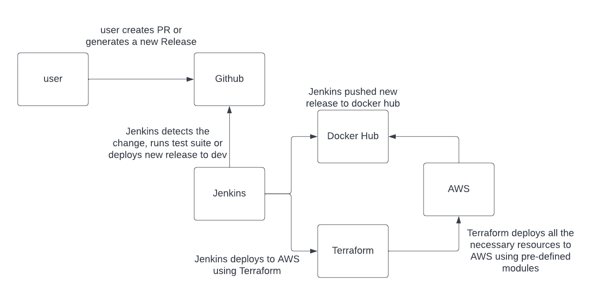

# sample-ci-cd

## About

This repo contains a great starting point for CI/CD of an application from completely nothing to a fully scalable, geo redunant application that is deployed on AWS using Jenkins.

The website can accessed from the following URL(s):

dev - https://sample-ci-cd-dev.dsquared.io/

prod - https://sample-ci-cd.dsquared.io/ (will deploy for demo during interview)

### important endpoints

##### healh checks
```
https://sample-ci-cd-dev.dsquared.io/healthz
```

##### admin
```
https://sample-ci-cd-dev.dsquared.io/admin
```

##### simulated delay for load testing
```
https://sample-ci-cd-dev.dsquared.io/work?delay=<time duration>
```

## Deploy to AWS

#### dev

```bash
TF_VAR_private_key="$(cat priv.key)" make deploy_dev
```

#### prod

```bash
TF_VAR_private_key="$(cat priv.key)" make deploy_prod
```

Our CI/CD tool will also pass in the sensitive private key through an ENV variable.

## Destroy Infrastructure

To destroy the environments when we no longer need them

#### dev

```bash
make destroy_dev
```

#### prod

```bash
make destroy_prod
```

## CI/CD workflows

Everytime a PR is created and/or new commits are added to the PR we will run the test suite against that commit and we will only allowing merging of that branch if everything passes. Then, when we cut a new release, it will automatically run the test suite, build the docker container, deploy the docker container to hub.docker.com, and finally run the terraform build which will deploy the app to the dev environment in AWS via our Jenkins instance. For production deployments I assume we will want to do those manually preferably during a maintenance window.

## Autoscaling

In AWS we setup autoscaling to our ECS cluster so if the application is experiencing enough load to pass a threshold it will deploy more instances of the application, to simulate load we will use the ddosify tool.

```bash
ddosify -t https://sample-ci-cd.dsquared.io/work?delay=2s -d 120
```

The load balancer is also setup to be round-robin.

## Diagram
